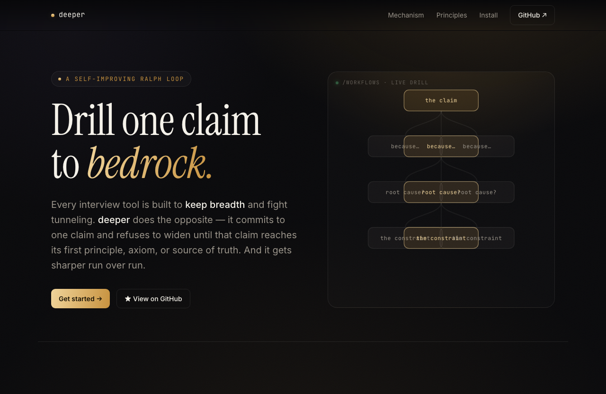

# deeper


<p align="center">
  
  <br>
  <em>deeper drills one claim to bedrock — each round fans out cold subagents in parallel, a judge keeps the deepest answer, the cursor descends. Landing page lives in <a href="./site/index.html"><code>site/</code></a>.</em>
</p>

<!-- Live /workflows demo GIF (optional): record the drill, then
     scripts/make-demo-gif.sh <clip.mov> → docs/assets/deeper-demo.gif and swap it in here. -->

A self-improving [ralph loop](https://ghuntley.com/ralph/) for **depth-first interviewing** — it drills ONE claim to its bedrock (first principle / axiom / source of truth) instead of widening. Every other interview skill (`superpowers:brainstorming`, `omx:deep-interview`, `gstack:office-hours`, `ouroboros`) is built to *keep breadth* and fight tunneling. deeper does the opposite: it commits to one claim and refuses to widen until that claim reaches bedrock — and it gets better run-over-run by promoting recurring mistakes into binding lessons.

**deeper is built for [Claude Code](https://claude.com/claude-code) — it runs on Claude Code's dynamic-workflow engine.** The whole drill *is* a dynamic workflow: each round it fans out cold subagents in parallel, a judge keeps the deepest answer, and the cursor descends — looping until every leaf reaches a verified bedrock. The DFS / judge / promotion logic is a pure, $0-unit-tested engine; the subagents do all the LLM work and filesystem I/O.

## Quick start

```bash
# 1. clone anywhere you like — no fixed path required
git clone https://github.com/xodn348/deeper.git
cd deeper

# 2. install — wires the /deeper command + its workflow into your Claude Code
./install.sh
```

Then, inside Claude Code, just use the slash command:

```
/deeper why does our checkout funnel keep regressing?
```

`/deeper` is a thin skill that launches the drill as a Claude Code **dynamic workflow** with your claim as the seed — you never invoke the workflow by hand. It streams live under `/workflows`, terminates when every leaf reaches a verified bedrock (or the cap), and persists lessons to `~/.deeper/runs/` so the next drill starts smarter.

`install.sh` adapts to **your** environment, not ours: it resolves the repo from its own location (clone it anywhere) and installs into `$CLAUDE_CONFIG_DIR` (default `~/.claude`), so nothing assumes a fixed layout. It's idempotent — re-run any time.

Verify the engine offline first ($0, no LLM):

```bash
node tests/test-drill-core.mjs   # 59 assertions
```

Full principle, architecture, `args`, and a *"how this differs from a vanilla dynamic workflow"* comparison live in **[`workflows/README.md`](./workflows/README.md)**.

## Philosophy

1. **Cold context every round (ralph).** In a single long session, context grows and the model starts rationalizing its own prior reasoning — adversarial pressure ("where does this break?") silently decays into self-consistency preservation. deeper re-injects the prompt with **fresh context** every round; only the node prompt + accumulated lessons + the *ancestor chain* (root → … → active claim, never siblings, never the whole tree) enter the generator's context.
2. **Depth-first to bedrock.** The cursor is always the DFS-deepest open leaf. A normal answer descends; a bedrock answer closes the leaf and pops to the next open one; a branch opens a parallel cause under the same parent. Never "what else?", never "compare to X", never widen.
3. **Disciplined termination.** "Bedrock" means an axiom — a stated value, constraint, prior decision, external rule, identity, or empirical fact — not "the model feels finished" and not an arbitrary turn count. Shallow bedrock (depth < 2) is a flagged violation.
4. **Self-improvement flywheel.** Each drill records its rule violations; recurring ones are promoted into a binding-lessons store; the next drill loads them and biases its questions away from the repeated mistake — improving the *quality distribution* of paths without anyone editing the prompt by hand.

## Mechanism — one drill, many rounds

The cursor is always the DFS-deepest open leaf. Each round:

1. **Find** `cursor` — the deepest open leaf.
2. **Build the ancestor chain** — root → … → cursor (never siblings, never the whole tree).
3. **Cold Q subagent** generates ONE depth question from the prompt + binding lessons + ancestor chain.
4. **Fan out `answer_fanout` cold A subagents (3 by default) in `parallel()`**, each forced down a *different* drilling angle (mechanism · hidden-assumption · boundary · root-vs-symptom · incentive · …). Every candidate is a **schema-typed** verdict: `descend | bedrock | branch | stop`.
5. **A judge subagent picks** the candidate that drills deepest toward bedrock (most specific, most genuinely contestable; a justified bedrock outranks a weak restatement). Only that one answer moves the cursor — the rest are discarded.
6. **If the chosen answer claims `bedrock`**, the adversarial gate fires (below) before the leaf may close.
7. **Mutate the tree**: `descend` → append child, cursor goes deeper · `bedrock` → close leaf, pop to next open · `branch` → append sibling, jump.
8. **Done** when no open leaf remains (every leaf closed at a *verified* bedrock), or on `spinning` / `cap`.

### How much it fans out per round

With the defaults, a normal round spends **5 subagents**: **1 cold Q + 3 parallel candidate A's + 1 judge**. A round whose chosen answer claims bedrock adds **3 skeptics** (the verify gate). Both widths are tunable 1–7 — `answer_fanout` for candidates, `verify_fanout` for skeptics. So a `cap`-N drill costs roughly **`2 + N×5` subagents** (Bootstrap + Evolve + the rounds); a 4-round drill is ~22 subagents.

This per-round fan-out is **why deeper runs on Claude Code's dynamic-workflow engine rather than a single chat loop**: every round gets `answer_fanout` independent attempts at the next step (not one), and the judge keeps the best — so a single weak or lazy answer can't set the direction of the whole descent.

Every round runs in **cold context** — a fresh subagent that sees only the prompt + lessons + ancestor chain, never the running session. That is what holds depth-first discipline across many rounds without the model rationalizing its own earlier reasoning.

### Worked example — rounds 1→4 (real run)

A live drill on seed *"why does our checkout funnel keep regressing?"* (`cap 4`, `answer_fanout 3`). Each round fans out 3 candidate answers in parallel from distinct angles (mechanism · hidden-assumption · boundary) and a judge keeps the deepest. Only the judge's pick is shown; the cursor descends exactly one level per round and never widens into sibling topics:

```
● seed: why does our checkout funnel keep regressing?
└─ R1 ▸ depth 0→1  [descend · judge kept the boundary candidate]
│    "Keeps regressing" is largely a measurement artifact: conversion is ONE aggregate
│    rate over an uncontrolled, shifting traffic mix, so every change in traffic
│    composition reads as a fresh regression — one no checkout-code fix can touch,
│    because it lives in the unsegmented denominator.
└─ R2 ▸ depth 1→2  [descend · judge kept the hidden-assumption candidate]
│    For that to be a real trend and not re-read noise, the period-over-period drops must
│    clear the rate's own sampling band — and the drill had silently assumed someone
│    computed it. Dashboards plot bare point estimates (no CI, no control limits, no MDE),
│    so "keeps" launders within-noise wiggles, narrated only when the number fell.
└─ R3 ▸ depth 2→3  [descend]
│    "The team lacks the instrument" rests on an unearned prior about who authored the
│    chart and which statistical idiom they default to — present-but-ignored and
│    never-instantiated are different root causes, asserted without verifying ownership.
└─ R4 ▸ depth 3→4  [descend]
     The authored-vs-inherited framing itself breaks: the funnel line wasn't authored —
     it was instantiated from a BI tool whose default template ships no band / UCL / MDE.
     So the bedrock is structural, not personal: missing statistical instrumentation is
     the path of least resistance in any general-purpose BI tool — zero competence to
     produce, positive effort to escape — so its presence says ~nothing about anyone's
     skill, only whether someone had reason to pay the escape cost.
```

Hit `auto_cap` at round 4. The run was **22 subagents** — Bootstrap + Evolve (2) plus, *per round*, one Q + three parallel candidate A's + one judge (4 × 5). Notice where it landed: the fan-out + judge pushed the drill past "ship a fix / add a guard" into the **epistemics of the metric itself** — a sharper descent than a single answerer reached on the same seed.

### Two fan-outs — generate, then verify

The drill fans out subagents at **two** points, both via `parallel()`:

- **Per round (generate → select).** `answer_fanout` candidate answers are produced in parallel from distinct angles, and a judge keeps the deepest. This is the primary fan-out — it runs *every* round, and it is the reason the drill needs a dynamic-workflow engine rather than a single chat loop.
- **At a bedrock candidate (verify).** A leaf is **not** allowed to close on the chosen answer's say-so. When the judge's pick claims `bedrock`, `verify_fanout` skeptic subagents (default 3) fan out in parallel, each trying to *refute* it with one more honest "why?". Majority-refute rejects the bedrock and forces one more descent into the strongest skeptic's deeper claim.

Both are breadth strictly in service of depth — generating better next steps and stress-testing terminal ones — never to widen the thread into sibling topics.

### How binding lessons shape paths

Lessons do **not** walk the tree directly — answers + cursor rules do. They shape the *questions*, which shape the answers, which shape the path. Indirect bias, compounding across runs. Example: a `shallow-bedrock` violation fires in run 3 and run 5 → it is promoted → run 6's generator probes deeper before letting any bedrock candidate through → run 6's trees close at depth 3+. Path *bias*, not path *forcing*.

## How it works as a Claude Code dynamic workflow

The dynamic-workflow engine **is** a deterministic orchestration runtime. deeper runs the philosophy above directly on it and closes the self-improvement flywheel inside one workflow:

```
Bootstrap (load BANS) → Drill / Verify (cold Q + parallel candidate A's + judge + skeptic gate) → Evolve (record · promote · persist)
```

- **No orchestration race.** The loop is a plain JS `while` with no turn boundaries, so the wake/notification races a hand-built launcher loop must guard against simply cannot occur.
- **Reliable termination.** The answer is a **schema-typed discriminated union** (`descend | bedrock | branch | stop`), validated at the tool layer. The answerer emits a *typed* bedrock — there is no prose-buried `BEDROCK:` for a string match to miss (the recognition failure that can leave a drill running to the cap; cf. [`examples/ecdsa-drift`](./examples/ecdsa-drift/)).
- **Parallelism is native.** `parallel()` gives the per-round candidate fan-out and the bedrock skeptic gate for free — the whole reason the drill lives on a workflow engine instead of a single chat loop.
- **A pure, $0-tested core.** All DFS / judge / promotion logic is a pure engine ([`workflows/drill-core.mjs`](./workflows/drill-core.mjs)) with 59 offline assertions. The workflow inlines a sync-guarded verbatim copy of that engine's `CORE` block (workflow scripts are sandboxed and cannot `import` local files); subagents do all filesystem I/O.
- **Automatic self-improvement.** Each drill promotes recurring violations to a persisted `BANS` store that the next drill's Bootstrap phase loads — no manual step.

See **[`workflows/README.md`](./workflows/README.md)** for the full write-up and the architecture diagram.

## Examples — recorded runs

Two worked drills with full traces (tree, events, digest, outcome).

| Run | Seed | Outcome | What's interesting |
|---|---|---|---|
| [`examples/address-clustering`](./examples/address-clustering/) | "find a creative way to do address clustering well" | 50R · `auto_cap` · 0 violations | Practical → empirical → epistemic → meta-epistemic ladder; surfaces 7 actionable clustering ideas en route to limits |
| [`examples/ecdsa-drift`](./examples/ecdsa-drift/) | "solve ECDSA cryptocraphy scheme" | 50R · `auto_cap` · 1 violation | Cautionary case — clean math reduction (R1–R19) bottoms out at ZFC, then drifts into pure epistemology and **never closes a single leaf** (50 rounds, 0 bedrock). Exactly the non-termination the schema-typed bedrock answer is built to prevent |

Each folder contains `README.md` (phase-by-phase summary), `digest-r1-r50.md` (all Q/A pairs), `tree.json`, `events.jsonl`, `outcome.json`.

## Repo layout

```
workflows/
├── deeper-native.js        # the dynamic workflow: Bootstrap → Drill/Verify → Evolve
├── drill-core.mjs          # pure engine — DFS state machine, runDrill, promoteBans
└── README.md               # full principle, architecture, args, vs vanilla workflow
tests/test-drill-core.mjs   # $0 engine + promotion + sync-guard suite (59 assertions)
skills/deeper/SKILL.md      # the /deeper slash command (launches the workflow)
install.sh                  # idempotent, path-agnostic installer
examples/                   # recorded drills with full traces (tree, events, digest, outcome)
docs/                       # ATTRIBUTION.md, INVOCATION-SOP.md, ADRs (design history)
legacy/                     # v1 origins — the bash ralph + feedback framework (archived)
```

## Why this exists

1. **Skills written into long markdown drift as conversations accumulate.** Huntley's ralph fixes this by re-injecting the same prompt every iteration with fresh context. Combining ralph with a feedback loop over structured logs gives a system that genuinely improves run-over-run without anyone editing the prompt by hand.
2. **Depth-first interviewing is missing.** Every existing interview skill explicitly fights tunneling. Root-cause work needs the opposite.
3. **The orchestration belongs in a runtime, not in bash.** deeper's loop runs on Claude Code's dynamic-workflow engine, where determinism, schema-typed signals, and parallel fan-out are native — so the scaffolding disappears and the failure modes it guarded against can't occur.

## Status

The engine is covered by 59 offline assertions; the workflow runs Bootstrap → Drill/Verify → Evolve end-to-end and self-improves across runs. The original bash implementation that proved these ideas is archived under [`legacy/`](./legacy/README.md).

## License

Source-available under the **Sustainable Use License v1.0** (see
[`LICENSE.md`](LICENSE.md)). Internal business use and non-commercial /
personal use are permitted. Commercial redistribution — including offering
deeper as a hosted service or embedding it in a paid product — requires a
separate commercial license from Junhyuk Lee.

Third-party components incorporated into deeper retain their original
licenses; see [`docs/ATTRIBUTION.md`](docs/ATTRIBUTION.md).
